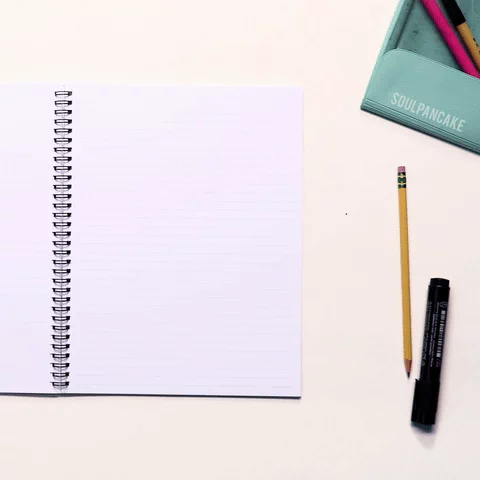

## Hi there 👋

    <h1>
        
    </h1>

---

    <h2>🚀 About Me</h2>
    

        
    

    

        I am a software engineering leader with 20+ years of cross-industry experience in:
        <ul>
            <li>Driving full product life cycles: ideation, design, and cloud migrations (AWS to GCP).</li>
            <li>Integrating AI/ML for enhanced gameplay and real-time engagement.</li>
            <li>Building high-performing teams and managing multimillion-dollar budgets.</li>
        </ul>
    

---

    <h2>🌐 Connect with Me</h2>
    
Let's collaborate and innovate together!

    
    

---

    <h2>💻 Programming Languages</h2>
    

        
        
        
        
        
        
        
    

---

    <h2>☁️ Cloud Technologies</h2>
    

        
        
        
        
        
        
        
        
    

---

    <h2>🔧 Frameworks</h2>
    <h4>Front-End Frameworks</h4>
    

        
        
    

    <h4>API/Data Management</h4>
    

        
        
        
        
    

    <h4>UI/Styling</h4>
    

      
      
      
      
    

    <h4>Testing Frameworks</h4>
    

      
      
      
    

    <h4>Development Tools:</h4>
    

      
      
      
      
      
    

    <h4>Other</h4>
    
 
      
      
      
      
      
      
      
    

---

    <h2>💻 GitHub Stats</h2>
    
Peek into my GitHub stats to see how I juggle code, coffee, and collaborations!

    
    
    

---

    
💻 Built with passion by <strong>Rob Sherman</strong>.

    
✨ Thanks for visiting my GitHub profile!

